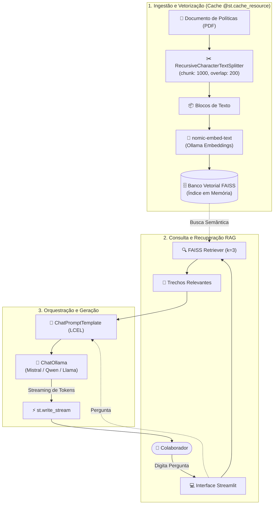

# 💼 Assistente de RH com IA (RAG Local & Privado)

[](https://www.python.org/)
[](https://streamlit.io/)
[](https://www.langchain.com/)
[](https://github.com/facebookresearch/faiss)
[](https://ollama.com/)

Assistente inteligente de Recursos Humanos para consulta de políticas internas corporativas (férias, benefícios, jornada de trabalho e conduta), desenvolvido com a arquitetura **RAG (Retrieval-Augmented Generation)**.

A aplicação opera **100% localmente e com privacidade total**, garantindo que nenhum dado sensível da empresa seja transmitido para APIs de terceiros.

---

## 🏛️ Arquitetura do Sistema



---

## ⚖️ Decisões de Engenharia e Arquitetura

| Decisão Técnica | Implementação | Motivo / Impacto |
| :--- | :--- | :--- |
| **Otimização de Cache** | `@st.cache_resource` | Evita a releitura do PDF e a regeneração de embeddings a cada interação ou re-execução do Streamlit. |
| **Banco Vetorial em Memória** | `FAISS (faiss-cpu)` | Busca vetorial semântica de altíssima velocidade sem a necessidade de infraestrutura pesada de banco externo. |
| **Filtro de Relevância ($k=3$)** | `as_retriever(k=3)` | Balanço ideal entre contexto suficiente e economia da janela de contexto da LLM, reduzindo alucinações. |
| **Baixa Latência Percebida** | `chain.stream()` + `st.write_stream` | Streaming de resposta token a token, entregando feedback imediato ao usuário (baixo Time-To-First-Token). |
| **Portabilidade de Ambiente** | `obter_url_ollama()` | Detecção dinâmica do host do Ollama, funcionando perfeitamente em Linux nativo, Docker e WSL2 (Windows Gateway). |
| **Desacoplamento do Pipeline** | LangChain Expression Language (LCEL) | Arquitetura modular que permite trocar o provedor de IA (Ollama / OpenAI / Gemini) sem alterar a interface. |

---

## 🌐 Portabilidade: Resolução Dinâmica de Ambiente (WSL & Docker)

Um dos desafios comuns no desenvolvimento de IA local no Windows/Linux é a comunicação entre o subsistema WSL2/Container e o servidor Ollama rodando no Windows Host.

O módulo [`rag/ollama_client.py`](rag/ollama_client.py) implementa um mecanismo de resolução automática em cascata:

1. **Variável Explícita:** Verifica se `OLLAMA_BASE_URL` foi configurado no `.env`.
2. **Localhost:** Testa conexões em `http://localhost:11434` e `http://127.0.0.1:11434`.
3. **WSL Gateway Resolver:** Se executado dentro do WSL2, identifica dinamicamente o IP do Host Windows via tabela de roteamento (`ip route | grep default`).
4. **Fallback Seguro:** Garante que a aplicação inicialize sem falhas silenciosas.

---

## 📁 Estrutura Modular do Projeto

```text
agente-ia-rh/
├── app.py                      # Interface de usuário interativa (Streamlit)
├── rag/                        # Módulo central de RAG (Lógica de Negócio)
│   ├── __init__.py             # Exportações públicas do pacote
│   ├── ollama_client.py        # Conector Ollama e resolução dinâmica de host
│   ├── ingest.py               # Extração de texto, chunking e indexação FAISS
│   └── chain.py                # Composição da chain RAG com LCEL
├── data/
│   └── politica_rh_exemplo.pdf # Documento fictício para demonstração
├── Dockerfile                  # Imagem de produção containerizada
├── docker-compose.yml          # Orquestração do serviço
├── .env.example                # Template documentado de variáveis de ambiente
├── .gitignore                  # Exclusão de caches, ambientes e segredos
├── requirements.txt            # Dependências fixadas do projeto
└── README.md                   # Documentação arquitetural e técnica
```

---

## 🚀 Como Executar

### 1. Pré-requisitos
- **Python 3.10+**
- **Ollama** instalado e em execução ([Download Ollama](https://ollama.com/download))

Baixe os modelos necessários no Ollama:
```bash
# Modelo de Embeddings (obrigatório)
ollama pull nomic-embed-text

# Modelos de Linguagem (baixe um ou mais)
ollama pull mistral:7b
ollama pull qwen2.5-coder:7b
ollama pull qwen3:4b
```

---

### Opção A: Execução Local com Python Virtualenv

1. **Clone o repositório:**
   ```bash
   git clone https://github.com/seu-usuario/agente-ia-rh.git
   cd agente-ia-rh
   ```

2. **Crie e ative o ambiente virtual:**
   ```bash
   python3 -m venv .venv
   source .venv/bin/activate   # No Windows: .venv\Scripts\activate
   ```

3. **Instale as dependências:**
   ```bash
   pip install -r requirements.txt
   ```

4. **Inicie a aplicação:**
   ```bash
   streamlit run app.py
   ```

---

### Opção B: Execução via Docker Compose

Caso prefira rodar a aplicação em container:

```bash
docker compose up --build
```

Acesse a interface no navegador: `http://localhost:8501`.

---

## 🔒 Nota de Confidencialidade e Dados Fictícios

> [!NOTE]
> O arquivo [`data/politica_rh_exemplo.pdf`](data/politica_rh_exemplo.pdf) incluído neste repositório contém **dados e regras fictícias**, gerado exclusivamente para fins didáticos e demonstração do pipeline RAG, em conformidade com as diretrizes de privacidade e LGPD.

---

## 📌 Limitações Conhecidas e Evoluções Futuras

Como parte das boas práticas de engenharia de software, as seguintes oportunidades de evolução foram mapeadas:

- [ ] **Índice Persistido em Disco:** Atualmente o FAISS opera em memória durante o ciclo do Streamlit. Uma evolução para larga escala é persistir o índice binário em disco ou utilizar um banco vetorial distribuído (Chroma / Qdrant / PgVector).
- [ ] **Ingestão Multi-Documento com Filtro de Metadados:** Suportar múltiplos manuais com filtragem por departamento (RH, TI, Financeiro, Jurídico).
- [ ] **Camada de Autenticação Corporativa (SSO):** Adição de autenticação via OIDC / Microsoft Entra ID para controle de acesso baseado em cargos (RBAC).
- [ ] **Avaliação Contínua de RAG (RAGAS):** Implementação de métricas de avaliação de fidelidade (faithfulness) e relevância de contexto.
